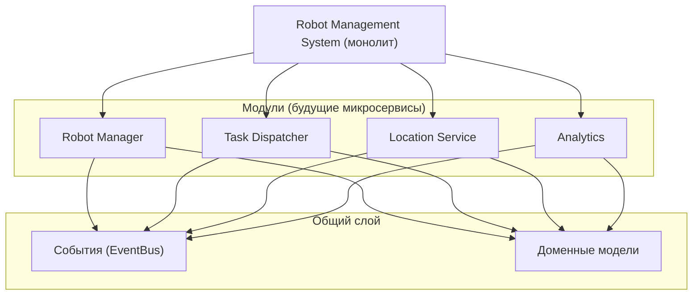

# Модульный монолит: архитектурный выбор

## 1. Почему модульный монолит?

На старте проекта мы выбираем **модульный монолит**, а не микросервисы, по следующим причинам:

| Критерий | Модульный монолит | Микросервисы (сразу) |
|----------|-------------------|----------------------|
| **Time‑to‑Market** | ✅ Быстрый старт (2–3 месяца) | ❌ Медленный (6+ месяцев) |
| **Сложность разработки** | ✅ Низкая (одна кодовая база) | ❌ Высокая (распределённые транзакции) |
| **Масштабируемость** | ⚠️ Горизонтально только целиком | ✅ Точечно |
| **Надёжность** | ❌ Ошибка в модуле может уронить всё | ✅ Отказ изолирован |
| **Гибкость стека** | ❌ Один язык/БД | ✅ Каждый сервис своё |
| **DevOps нагрузка** | ✅ Минимальная | ❌ Высокая |

**Вывод:** модульный монолит — это **стратегический выбор**, который даёт нам скорость на старте и плавный путь к эволюции.

---

## 2. Что такое «модульный» монолит?

В отличие от классического «грязного» монолита (Big Ball of Mud), где всё переплетено, модульный монолит строится на принципах **DDD (Domain-Driven Design)**:

- **Каждый модуль** соответствует ограниченному контексту (Bounded Context).
- **Границы модулей** чётко определены.
- **Модули общаются** через интерфейсы или события, а не через прямые вызовы внутренних структур.
- **Данные изолированы** — каждый модуль имеет свою схему БД (или хотя бы таблицы).

### 🔍 Сравнение

| Характеристика | Грязный монолит | Модульный монолит |
|----------------|-----------------|-------------------|
| Границы модулей | Размытые | Чёткие (DDD) |
| Обмен данными | Прямой доступ к данным | Через API/события |
| Тестирование | Сложно изолировать | Модули тестируются отдельно |
| Распил на сервисы | Практически невозможен | Предсказуемый и лёгкий |

---

## 3. Структура модулей в RMS

Мы выделяем **четыре ключевых модуля** (каждый — будущий микросервис):

| Модуль | Ответственность | Будущий сервис |
|--------|-----------------|----------------|
| **Robot Manager** | Хранит состояние роботов, статусы, телеметрию. | `robot-manager` |
| **Task Dispatcher** | Распределяет задачи, управляет очередями, приоритетами. | `task-dispatcher` |
| **Location Service** | Управляет локациями, маршрутами, ограничениями. | `location-service` |
| **Analytics** | Собирает метрики, агрегирует данные, строит отчёты. | `analytics` |

Каждый модуль имеет свою внутреннюю структуру (API → Service → Repository → Domain), что соответствует **Clean Architecture**.

---

## 4. Как обеспечивается слабая связанность

1. **Интерфейсы** — модули не зависят от реализации друг друга.
2. **События** — модули общаются через абстрактную шину (`EventBus`).
3. **`go.work`** — позволяет разрабатывать модули как независимые пакеты в рамках монорепозитория.

### 📦 Пример импорта (после распила):

```go
// Внутри монолита
import "robot-fleet-orchestrator/internal/modules/robot-manager"

// После выноса в микросервис
import "github.com/company/robot-manager"
```

Разница — только в пути импорта. Код модуля не меняется.

---

## 5. Метрики качества модулей

Используем метрики Роберта Мартина для оценки:

- **Абстрактность (A)** — доля интерфейсов в модуле.
- **Нестабильность (I)** — соотношение входящих/исходящих зависимостей.
- **Расстояние от главной последовательности (D)** — баланс между A и I.

> Идеальный модуль: `A + I ≈ 1` (не слишком абстрактный и не слишком конкретный).

---

## 6. План эволюционного распила

Подробно описан в `03-evolution-to-microservices.md`. Кратко:

1. Начинаем с монолита с чёткими границами.
2. Постепенно выносим модули по мере роста нагрузки/команды.
3. Заменяем in-memory шину на Kafka (без изменения кода модулей).

---

## 7. Связь с эволюционной архитектурой

- **Фитнес-функции** проверяют, что модули не нарушают границы (триггерные тесты при коммите).
- **Инкрементальные изменения** — каждый шаг распила проверяется и откатывается при необходимости.
- **Связанность** управляется через события, а не через прямые вызовы.

---

## 📎 Связанные документы

- [Обзор архитектуры](01-architecture-overview.md)
- [Эволюционный распил](03-evolution-to-microservices.md)
- [Event-Driven архитектура](04-event-driven.md)
- [Риски и компромиссы](10-risks-and-tradeoffs.md)

---

## 🗺️ Диаграмма модулей (Mermaid)



---

*Дата последнего обновления: 15 июля 2026*
