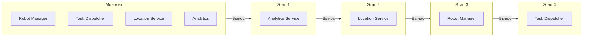

# Эволюционный переход от монолита к микросервисам

## 1. Зачем переходить к микросервисам?

Модульный монолит даёт быстрый старт, но по мере роста системы возникают причины для выноса модулей в отдельные сервисы:

| Причина | Объяснение |
|---------|------------|
| **Нагрузка** | Один модуль потребляет больше ресурсов — его нужно масштабировать отдельно. |
| **Частота изменений** | Модуль меняется часто — независимый релизный цикл ускоряет разработку. |
| **Размер команды** | Команда выросла — разные группы хотят работать над разными модулями без конфликтов. |
| **Технологическая гибкость** | Модуль требует другого языка/БД — вынос позволяет это сделать. |
| **Отказоустойчивость** | Сбой в одном модуле не должен останавливать всю систему. |

---

## 2. Какой модуль выносить первым?

Мы выбираем модуль с **наименьшей связанностью** и **наибольшей бизнес-ценностью** для первого выноса.

### 📌 Очерёдность выноса (рекомендуемая)

1. **Analytics** — наименее связан, легко изолировать, даёт быстрый win (метрики, отчёты).
2. **Location Service** — умеренная связанность, но чёткие границы.
3. **Robot Manager** — ядро системы, выносится, когда механизмы событий и синхронизации отлажены.
4. **Task Dispatcher** — самый сложный, выносится последним, когда отлажена оркестрация через события.

### 🗺️ Диаграмма этапов (Mermaid)



---

## 3. Технический механизм перехода

### 🔹 `go.work` — локальная разработка в монорепозитории

- Все модули разрабатываются как независимые пакеты внутри одного репозитория.
- `go.work` позволяет собирать и запускать их локально, как если бы они уже были микросервисами.

```go
// Пример go.work
go 1.23

use (
    ./cmd/orchestrator
    ./internal/modules/robot-manager
    ./internal/modules/task-dispatcher
    ./internal/modules/location-service
    ./internal/modules/analytics
    ./pkg/...
)
```

### 🔹 Замена шины событий

**В монолите:** используется `InMemoryBus` — события доставляются синхронно внутри процесса.

**При распиле:** заменяем `InMemoryBus` на `KafkaBus` — модули продолжают использовать один и тот же интерфейс `EventBus`, не меняя кода.

```go
// Абстракция EventBus
type EventBus interface {
    Publish(ctx context.Context, topic string, event interface{}) error
    Subscribe(topic string, handler func(interface{})) error
    Close() error
}
```

**Пример переключения:**

```go
// В монолите
bus := eventbus.NewInMemoryBus()

// После распила
bus, err := eventbus.NewKafkaBus([]string{"kafka:9092"})
```

---

## 4. Обеспечение бесшовности

- **Постепенный перевод трафика** — часть модулей остаётся в монолите, часть работает как сервисы.
- **Обратная совместимость API** — события и контракты не меняются.
- **Feature flags** — возможность откатиться на монолит при обнаружении проблем.

### 🧪 Стратегия тестирования

- **Интеграционные тесты** проверяют взаимодействие через шину.
- **Нагрузочные тесты** сравнивают производительность до и после выноса.
- **Canary-релизы** — сначала запускаем новый сервис для части трафика.

---

## 5. Связь с эволюционной архитектурой

- **Фитнес-функции** следят, чтобы при распиле не упала производительность (например, latency < 100 мс).
- **Инкрементальные изменения** — каждый вынос делается маленьким шагом и проверяется.
- **ADR (Architecture Decision Records)** — каждое решение по выносу документируется.

---

## 6. Риски и их митигация

| Риск | Митигация |
|------|-----------|
| Распил сложнее, чем планировалось | Чёткие границы модулей с самого начала, ADR, регулярные архитектурные ревью. |
| Потеря производительности из-за сети | Использование Kafka с сжатием, асинхронность, кэширование. |
| Усложнение отладки | Распределённый трейсинг (OpenTelemetry), структурированные логи. |
| Команда не готова | Постепенное внедрение, обучение, менторинг. |

---

## 📎 Связанные документы

- [Модульный монолит](02-modular-monolith.md)
- [Event-Driven архитектура](04-event-driven.md)
- [Highload и отказоустойчивость](08-highload-fault-tolerance.md)
- [Риски и компромиссы](10-risks-and-tradeoffs.md)

---

*Дата последнего обновления: 15 июля 2026*