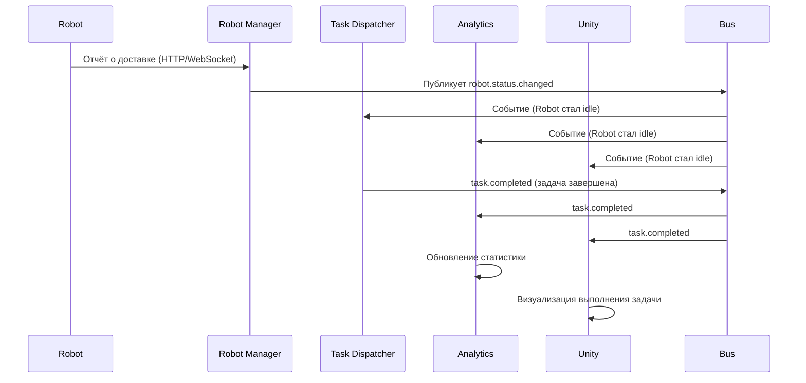
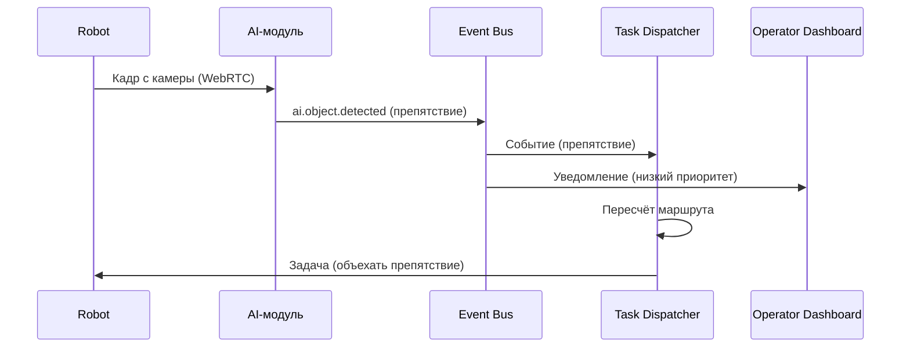

# Event-Driven архитектура

## 1. Что такое Event-Driven архитектура?

Event-Driven архитектура (EDA) — это шаблон проектирования, при котором **компоненты системы обмениваются асинхронными событиями**, а не синхронными вызовами. Отправитель (publisher) не знает, кто и как обрабатывает событие, а получатель (subscriber) реагирует на события, не вызывая их напрямую.

---

## 2. Почему Event-Driven?

| Причина | Объяснение |
|---------|------------|
| **Слабая связанность** | Модули не зависят друг от друга — только от формата событий. |
| **Асинхронность** | Отправитель не ждёт ответа — это снижает задержку. |
| **Отказоустойчивость** | Сбой одного модуля не влияет на другие (события сохраняются в очереди). |
| **Масштабируемость** | Можно добавить новых подписчиков без изменения существующих модулей. |
| **Трассировка и аудит** | Все события логируются — легко отследить поток выполнения. |

---

## 3. Реализация в RMS

### 🔹 Абстракция шины

```go
type EventBus interface {
    Publish(ctx context.Context, topic string, event interface{}) error
    Subscribe(topic string, handler func(interface{})) error
    Close() error
}
```

- **В монолите:** `InMemoryBus` — события доставляются синхронно внутри процесса.
- **При распиле:** `KafkaBus` — события доставляются через брокер сообщений.

Модули **не знают**, какая реализация используется. Это позволяет легко переключиться с InMemoryBus на Kafka без изменения бизнес-логики.

### 🔹 Ключевые события

| Событие | Отправитель | Подписчики |
|---------|-------------|------------|
| `robot.status.changed` | Robot Manager | Task Dispatcher, Analytics, Unity |
| `task.assigned` | Task Dispatcher | Robot Manager, Analytics |
| `task.completed` | Robot Manager | Task Dispatcher, Analytics, Unity |
| `location.updated` | Location Service | Task Dispatcher, Unity |
| `ai.object.detected` | AI-модуль | Task Dispatcher, Analytics, Unity |
| `ai.speech.command` | AI-модуль | Task Dispatcher, Unity |

---

## 4. Потоки событий (пример)

### 📌 Сценарий: робот сообщил о доставке



### 📌 Сценарий: AI обнаружил препятствие



---

## 5. Идемпотентность и обработка дублей

- **Идемпотентность:** каждое событие может обрабатываться несколько раз без изменения результата.
- **Дубликаты:** UUID события + проверка на стороне подписчика.

```go
type Event struct {
    ID        uuid.UUID
    Timestamp time.Time
    Type      string
    Payload   interface{}
}
```

---

## 6. Связь с хореографией и оркестрацией

| Паттерн | Как используется |
|---------|------------------|
| **Хореография** | Модули общаются через события (Robot Manager → Analytics, Unity). Каждый модуль знает, как реагировать. |
| **Оркестрация** | Task Dispatcher управляет сложными процессами (например, цепочка доставки). |

---

## 7. Связь с эволюционной архитектурой

- **Фитнес-функция:** проверка, что все события доставляются за < 50 мс.
- **Триггерная фитнес-функция:** при каждом коммите проверяется, что все подписки валидны.
- **Готовность к распилу:** замена InMemoryBus на Kafka не требует изменения кода модулей.

---

## 📎 Связанные документы

- [Модульный монолит](02-modular-monolith.md)
- [Эволюционный распил](03-evolution-to-microservices.md)
- [AI-модуль](06-ai-module.md)
- [Highload и отказоустойчивость](08-highload-fault-tolerance.md)

---

*Дата последнего обновления: 15 июля 2026*