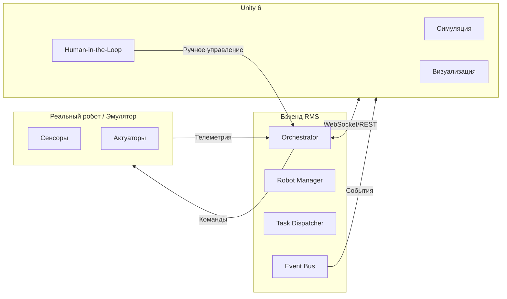
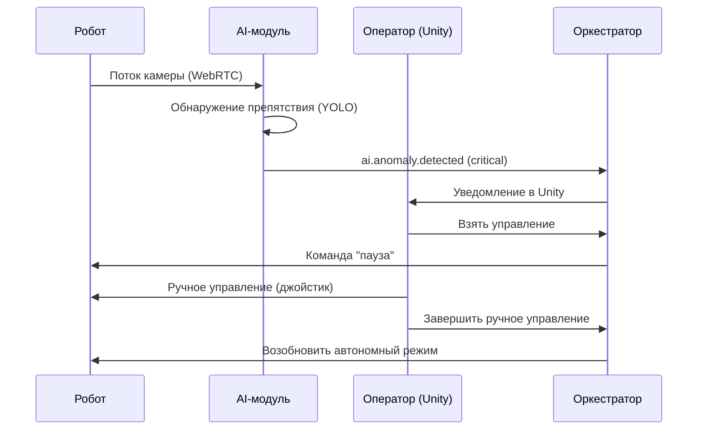
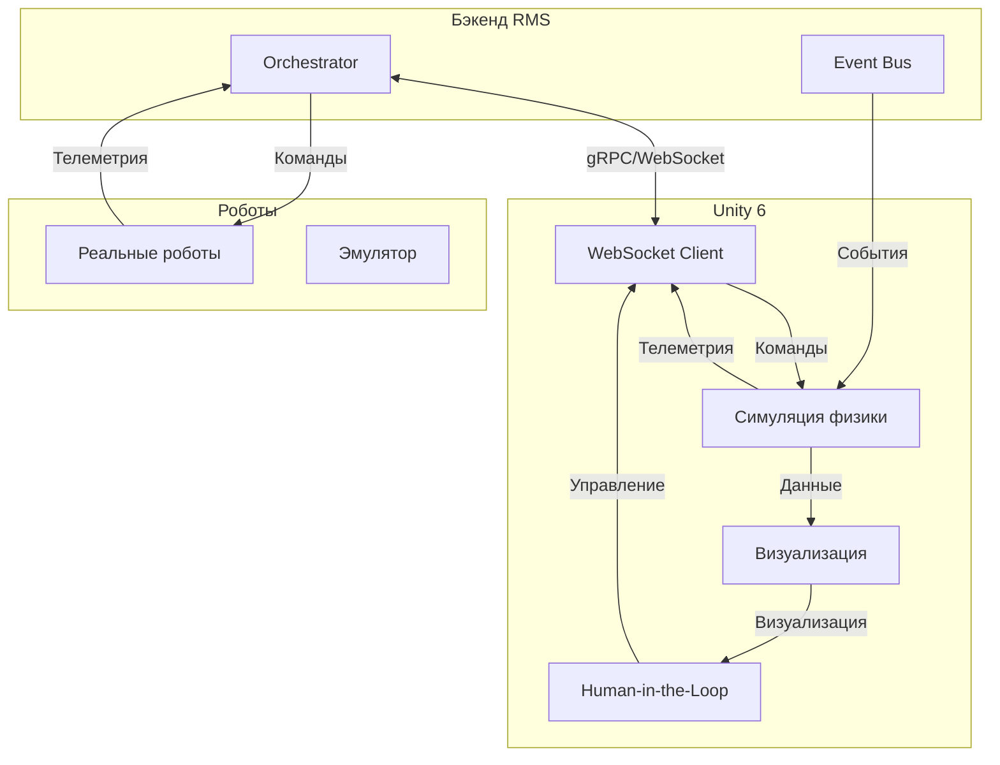

# Unity 6 — цифровой двойник системы управления роботами

## 1. Зачем нужен цифровой двойник?

Unity 6 в нашем проекте — это не просто «симулятор физики». Это **полноценный цифровой двойник (Digital Twin)**, который решает четыре ключевые задачи:

| Задача | Описание |
|--------|----------|
| **Тестирование без риска** | Проверка алгоритмов на симуляции, а не на реальных роботах (экономия оборудования и времени). |
| **Обучение персонала** | Операторы и инженеры тренируются на виртуальных роботах без риска поломки. |
| **Маркетинг и демонстрации** | Интерактивная 3D-визуализация склада для инвесторов и клиентов. |
| **Human-in-the-loop** | Оператор может видеть роботов в реальном времени и вмешиваться в критических ситуациях. |

---

## 2. Архитектура интеграции Unity с бэкендом

### 🔹 Компоненты



### 🔹 Протоколы взаимодействия

| Интерфейс | Используется для | Протокол |
|-----------|------------------|----------|
| **Команды роботам** | Отправка маршрутов, задач, остановок | gRPC / WebSocket |
| **Телеметрия** | Получение координат, статусов, видео | WebRTC / WebSocket |
| **События RMS** | Подписка на `robot.status.changed`, `task.completed` | Event Bus |
| **Ручное управление** | Оператор управляет роботом через Unity | WebSocket / REST |

---

## 3. Что мы моделируем в Unity

| Элемент | Описание |
|---------|----------|
| **Роботы** | 3D-модели с правильной кинематикой (Unity Articulation Body). |
| **Физика мира** | Коллизии, гравитация, трение (PhysX в Unity 6). |
| **Сенсоры** | Эмуляция камеры, лидара, GPS (для AI-модуля). |
| **Сетевые сбои** | Имитация задержек, потери пакетов, обрывов связи. |
| **AI-события** | Визуализация обнаруженных объектов, голосовых команд. |

---

## 4. Human-in-the-loop (Оператор в цикле)

### 🔹 Три уровня обработки

| Уровень | Исполнитель | Действие |
|---------|-------------|----------|
| **1. Робот** | Автоматика | Выполняет задачи, публикует телеметрию. |
| **2. AI** | AI-модуль | Анализирует видео/аудио, выявляет аномалии, публикует события. |
| **3. Человек** | Оператор | Получает уведомления, при необходимости берёт управление вручную. |

### 🔹 Процесс вмешательства



---

## 5. Техническая реализация

### 🔹 Интеграция с бэкендом

```go
// Отправка телеметрии из Unity в бэкенд
type Telemetry struct {
    RobotID   string
    Position  Point
    Rotation  Quaternion
    Timestamp time.Time
    VideoURL  string // ссылка на WebRTC-поток
}

// Unity → RMS через WebSocket
func (u *UnityConn) SendTelemetry(ctx context.Context, telemetry Telemetry) error {
    // ...
}
```

### 🔹 Визуализация AI-событий в Unity

```go
// Получение событий из шины
func (u *UnityConn) SubscribeToAIService(ctx context.Context, bus eventbus.EventBus) {
    bus.Subscribe("ai.object.detected", func(event interface{}) {
        obj := event.(AIObjectDetected)
        u.DisplayObject(obj) // отображение в 3D-сцене
    })
}
```

---

## 6. Бизнес-ценность Unity-решения

| Направление | Ценность |
|-------------|----------|
| **Экономия на оборудовании** | Тестирование в симуляции заменяет дорогостоящие полигонные испытания. |
| **Ускорение разработки** | Тысячи сценариев прогоняются за ночь вместо недель на реальных роботах. |
| **Обучение** | Симулятор можно развернуть на десятках компьютеров для обучения персонала. |
| **Маркетинг** | Интерактивная демка склада для инвесторов и клиентов. |
| **AI-обучение** | Генерация синтетических данных для моделей компьютерного зрения. |

---

## 7. План внедрения Unity

| Этап | Срок | Описание |
|------|------|----------|
| **0 (MVP)** | 1–2 недели | Простая симуляция с кубами-роботами, управление через HTTP. |
| **1** | 1 месяц | 3D-модель склада, WebSocket-интеграция, базовая физика. |
| **2** | 2 месяца | Полноценный цифровой двойник с DOTS, сетевыми эмуляциями, AI-визуализацией. |
| **3** | 3 месяца | Human-in-the-loop, управление через джойстик, интеграция с реальными роботами. |

---

## 8. Риски и митигация

| Риск | Митигация |
|------|-----------|
| **Производительность Unity** | Использование DOTS, ECS, Burst Compiler, LOD. |
| **Сложность интеграции** | Использование ROS-TCP-Connector, унифицированных API. |
| **Задержки в симуляции** | Оптимизация физики, уменьшение количества объектов в сцене. |
| **Кадровый вопрос (специалисты Unity)** | На старте достаточно одного инженера (есть у меня), позже — выделенная команда. |

---

## 🗺️ Диаграмма интеграции



---

## 📎 Связанные документы

- [Обзор архитектуры](01-architecture-overview.md)
- [AI-модуль](06-ai-module.md)
- [Highload и отказоустойчивость](08-highload-fault-tolerance.md)
- [Риски и компромиссы](10-risks-and-tradeoffs.md)

---

*Дата последнего обновления: 15 июля 2026*