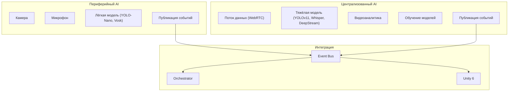
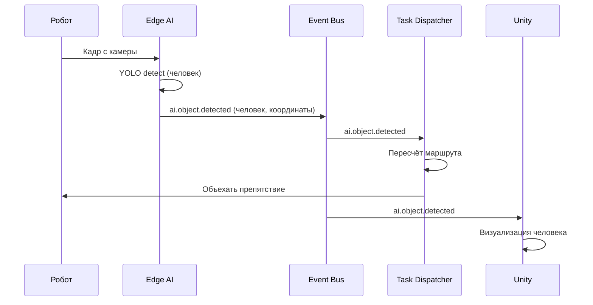

# AI-модуль: интеллектуальная обработка данных роботов

## 1. Зачем AI в системе управления роботами?

AI-модуль расширяет возможности роботов, позволяя им:

- **Видеть** (распознавание объектов, людей, препятствий)
- **Слышать** (голосовые команды, звуковые сигналы)
- **Анализировать** (видеоинспекция, обнаружение аномалий)
- **Взаимодействовать** (общение с персоналом)

Это превращает роботов из простых исполнителей в **интеллектуальных агентов**, способных адаптироваться к изменяющейся среде.

---

## 2. Архитектура AI-модуля

### 🔹 Два режима работы

| Режим | Исполнение | Задержка | Примеры задач |
|-------|------------|----------|---------------|
| **Периферийный (Edge AI)** | На борту робота (GPU/NPU) | < 50 мс | Обнаружение препятствий, навигация, распознавание лиц |
| **Централизованный (Cloud/Backend AI)** | На бэкенде (GPU-кластер) | 100–300 мс | Сложная видеоаналитика, обработка речи, обучение моделей |

Оркестратор динамически выбирает режим в зависимости от доступности сети, заряда батареи и типа задачи.

### 🔹 Компоненты AI-модуля

---

## 3. Ключевые функции AI

### 🔹 Распознавание объектов (Computer Vision)

- **Модель:** YOLOv11 (или аналоги) для обнаружения объектов в реальном времени.
- **Задачи:** 
  - Обнаружение препятствий (ямы, стеллажи, люди).
  - Распознавание QR-кодов и маркеров.
  - Инспекция качества (проверка целостности грузов).
- **Событие:** `ai.object.detected` (тип объекта, координаты, уверенность).

### 🔹 Распознавание голоса (Speech Recognition)

- **Модель:** Whisper (OpenAI) для офлайн-распознавания, Vosk для периферийного режима.
- **Задачи:**
  - Приём голосовых команд от персонала («Привези груз в зону 5»).
  - Обнаружение звуковых сигналов (сирена, крик о помощи).
- **Событие:** `ai.speech.command` (команда, идентификатор говорящего).

### 🔹 Видеоаналитика (Video Analytics)

- **Инструменты:** DeepStream (NVIDIA) или собственная реализация на Go + OpenCV.
- **Задачи:**
  - Подсчёт объектов на складе (паллеты, люди).
  - Детекция движения и аномалий.
  - Распознавание лиц (для доступа к закрытым зонам).
- **Событие:** `ai.video.analytics` (тип аналитики, данные).

---

## 4. Интеграция с оркестратором

### 🔹 События AI

| Событие | Описание | Подписчики |
|---------|----------|------------|
| `ai.object.detected` | Объект обнаружен (тип, координаты, уверенность) | Task Dispatcher, Unity, Analytics |
| `ai.speech.command` | Голосовая команда распознана | Task Dispatcher, Unity |
| `ai.video.analytics` | Результат видеоаналитики | Analytics, Unity |
| `ai.anomaly.detected` | Аномалия обнаружена (уровень критичности) | Task Dispatcher, Operator Dashboard |

### 🔹 Влияние на маршрутизацию

- **Обнаружение препятствия:** Task Dispatcher пересчитывает маршрут.
- **Голосовая команда:** оркестратор интерпретирует её как новую задачу.
- **Аномалия (высокий приоритет):** оператор получает уведомление в Unity.

---

## 5. Технологический стек

| Компонент | Технология | Примечание |
|-----------|------------|------------|
| **Распознавание объектов (Edge)** | YOLO-Nano, TensorFlow Lite | Запуск на борту робота |
| **Распознавание объектов (Cloud)** | YOLOv11, PyTorch | Запуск на GPU-сервере |
| **Распознавание голоса** | Whisper (OpenAI), Vosk | Vosk — для периферии |
| **Видеоаналитика** | DeepStream, OpenCV | Обработка потоков |
| **Интерпретация команд** | LLM (GPT или локальная модель) | Понимание сложных запросов |
| **Интеграция с Go** | gRPC, WebRTC, Kafka | Для передачи данных и событий |

---

## 6. Вызовы и ограничения

| Вызов | Решение |
|-------|---------|
| **Высокая нагрузка на GPU** | Использование периферийного AI для простых задач, централизованного — для сложных. |
| **Задержки при передаче видео** | Оптимизация через WebRTC, сжатие кадров. |
| **Качество данных** | Фильтрация ложных срабатываний, применение ансамбля моделей. |
| **Безопасность** | Шифрование видеопотоков, авторизация подписчиков. |

---

## 7. Связь с эволюционной архитектурой

- **Фитнес-функция:** проверка точности распознавания (≥ 95% для критических объектов).
- **Триггерная фитнес-функция:** при добавлении новой модели запускаются тесты на синтетических данных.
- **Инкрементальность:** модель можно обновлять без перезапуска всей системы (версионирование моделей).

---

## 8. Бизнес-ценность AI-модуля

| Направление | Ценность |
|-------------|----------|
| **Безопасность** | Обнаружение людей и препятствий предотвращает аварии. |
| **Эффективность** | Голосовые команды ускоряют взаимодействие с персоналом. |
| **Качество** | Видеоинспекция гарантирует целостность грузов. |
| **Автономность** | Роботы могут работать в условиях неполной информации. |

---

## 📎 Связанные документы

- [Обзор архитектуры](01-architecture-overview.md)
- [Event-Driven архитектура](04-event-driven.md)
- [Unity-симуляция](05-unity-simulation.md)
- [Риски и компромиссы](10-risks-and-tradeoffs.md)

---

*Дата последнего обновления: 15 июля 2026*