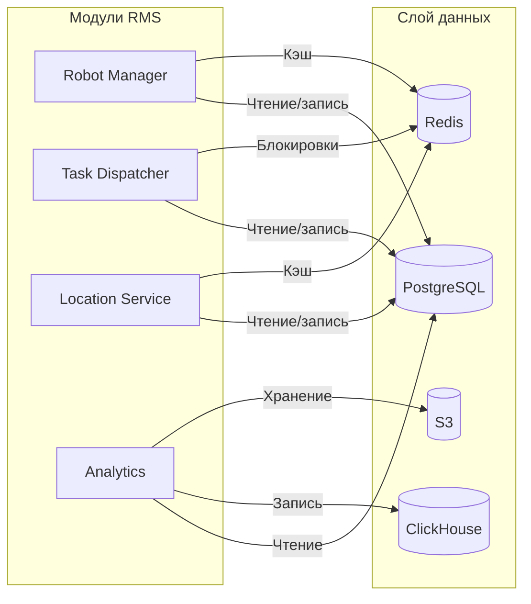

# Слой данных: хранилища и управление информацией

## 1. Зачем выделять слой данных в отдельный документ?

Слой данных — это фундамент, на котором строится вся платформа RMS. Он определяет:
- **Производительность** (быстрый доступ к состояниям роботов, задач, локаций)
- **Масштабируемость** (горизонтальное расширение, шардирование)
- **Надёжность** (репликация, бэкапы, отказоустойчивость)
- **Гибкость** (возможность добавлять новые типы данных без перестройки всей системы)

---

## 2. Обзор хранилищ и их назначение

| Хранилище | Тип | Назначение |
|-----------|-----|------------|
| **PostgreSQL** | Реляционная СУБД (OLTP) | Транзакционные данные (роботы, задачи, локации, история событий) |
| **Redis** | In-memory key-value store | Кэш состояний, сессии, распределённые блокировки |
| **ClickHouse** | Колоночная аналитическая СУБД | Метрики, агрегаты, аналитика (этап 2) |
| **S3-совместимое хранилище** | Объектное хранилище | Хранение видео/аудио/изображений от AI (этап 2) |

---

## 3. Почему такой выбор?

### 🔹 PostgreSQL — транзакционное ядро

| Характеристика | Преимущество |
|----------------|--------------|
| **ACID** | Гарантирует консистентность для критических операций (назначение задач, обновление статусов). |
| **Индексы** | B-Tree / GIN для быстрого поиска по ID, времени, типу робота. |
| **Репликация** | Master-slave / streaming replication для высокой доступности. |
| **Знакомство** | Стандартный инструмент, легко найти инженеров. |

**Примеры таблиц:**
- `robots` (id, type, status, location, battery, capacity)
- `tasks` (id, type, priority, status, assigned_to, created_at)
- `locations` (id, name, type, bounds, allowed_robot_types)

### 🔹 Redis — кэш и быстрые операции

| Характеристика | Преимущество |
|----------------|--------------|
| **Скорость** | < 1 мс на операцию, идеально для горячих данных (состояния роботов, сессии операторов). |
| **Поддержка структур** | Хеши, списки, множества — удобно для хранения последних координат, очередей. |
| **Pub/Sub** | Можно использовать как лёгкую альтернативу шине для внутрисистемных уведомлений. |

**Примеры использования:**
- Кэш состояния роботов: `robot:status:{id}` → `{"status":"busy","location":"...","battery":85}`
- Сессии операторов: `session:{token}` → `{"operator_id":"...","permissions":[...]}`
- Распределённые блокировки: `lock:task:{id}` → предотвращает двойное назначение задач.

### 🔹 ClickHouse — аналитика (этап 2)

| Характеристика | Преимущество |
|----------------|--------------|
| **Колоночное хранение** | Эффективное сжатие и быстрые агрегаты для больших объёмов (миллионы событий в день). |
| **Партиционирование** | Деление по времени (почасовое/посуточное) для ускорения запросов. |
| **Встроенный движок** | Поддержка `MergeTree`, `ReplicatedMergeTree` для отказоустойчивости. |

**Примеры использования:**
- Агрегаты времени отклика: `SELECT avg(latency) FROM events WHERE robot_id = ... AND date >= today()-7`
- Отчёты по загрузке роботов: `SELECT robot_id, count() FROM tasks GROUP BY robot_id`
- Тренды потерь пакетов: `SELECT timestamp, loss_rate FROM network_metrics`

### 🔹 S3-совместимое хранилище (этап 2)

| Характеристика | Преимущество |
|----------------|--------------|
| **Масштабируемость** | Хранение терабайт видео/аудио без ограничений. |
| **Доступность** | Репликация на несколько зон (обеспечивает 99.999% доступности). |
| **Интеграция** | Лёгкая интеграция с AI-сервисами через предподписанные URL. |

**Примеры использования:**
- Хранение видеозаписей с камер: `s3://rms/videos/{robot_id}/{timestamp}.mp4`
- Аудиофайлы голосовых команд: `s3://rms/audio/{operator_id}/{timestamp}.wav`
- Снимки для обучения AI: `s3://rms/training/dataset_{date}.tar`

---

## 4. Взаимодействие слоёв с модулями



---

## 5. Миграция и масштабирование

### 🔹 PostgreSQL
- **Версионирование схемы:** использование миграций (golang-migrate / tern).
- **Индексы:** мониторинг и оптимизация запросов через `EXPLAIN`.
- **Шардирование:** при росте данных > 1 ТБ — использование Citus или ручное шардирование по `robot_id`.

### 🔹 Redis
- **Кластеризация:** использование Redis Cluster для горизонтального масштабирования.
- **Eviction policy:** настройка `allkeys-lru` для автоматического удаления старых данных.

### 🔹 ClickHouse
- **Партиционирование:** по дням (для быстрых агрегатов) + TTL для удаления старых данных.
- **Репликация:** конфигурация `ReplicatedMergeTree` для отказоустойчивости.

### 🔹 S3
- **Жизненный цикл:** автоматическое перемещение старых файлов в холодное хранилище (Glacier).
- **Версионирование:** включено для защиты от случайного удаления.

---

## 5.1. Шардирование кэша с Consistent Hashing

Для кэширования состояний роботов и других горячих данных мы используем **Redis Cluster**, но слой приложения управляет выбором шарда через алгоритм **Consistent Hashing с виртуальными узлами**.

### 🔹 Принцип работы Consistent Hashing

1. **Хеш-кольцо:** все доступные шарды (Redis-ноды) размещаются на кольце в диапазоне `[0, 2^32-1]` (или `[0, 2^64-1]`).
2. **Виртуальные узлы:** каждый физический шард представлен множеством виртуальных узлов (например, 100–200), распределённых по кольцу. Это обеспечивает равномерное распределение данных.
3. **Поиск шарда для ключа:**
   - Вычисляется хеш ключа (например, `robot:status:123`).
   - На кольце выполняется **бинарный поиск** по отсортированным виртуальным узлам.
   - Если найден узел с хешем >= хеша ключа, выбирается соответствующий физический шард.
   - Если такого узла нет (хеш ключа больше максимального), выбор падает на **первый узел** на кольце (замыкание по часовой стрелке).

### 🔹 Преимущества

| Характеристика | Преимущество |
|----------------|--------------|
| **Минимальный решардинг** | При добавлении нового шарда перемещается только `1/N` данных (где `N` — число шардов). |
| **Гибкость** | Можно добавлять/удалять шарды без остановки системы. |
| **Балансировка** | Виртуальные узлы гарантируют равномерное распределение ключей. |

### 🔹 Реализация в Go

```go
package shard

import (
    "sort"
    "strconv"
)

type ConsistentHash struct {
    nodes       []uint32          // отсортированный список хешей виртуальных узлов
    ring        map[uint32]string // хеш → адрес шарда
    virtual     int               // количество виртуальных узлов на один физический
}

func New(virtual int) *ConsistentHash {
    return &ConsistentHash{
        nodes:   []uint32{},
        ring:    make(map[uint32]string),
        virtual: virtual,
    }
}

// AddNode добавляет физический шард (адрес) с виртуальными узлами.
func (c *ConsistentHash) AddNode(node string) {
    for i := 0; i < c.virtual; i++ {
        hash := hashKey(node + ":" + strconv.Itoa(i))
        c.nodes = append(c.nodes, hash)
        c.ring[hash] = node
    }
    sort.Slice(c.nodes, func(i, j int) bool { return c.nodes[i] < c.nodes[j] })
}

// GetNode возвращает шард для ключа.
func (c *ConsistentHash) GetNode(key string) string {
    if len(c.nodes) == 0 {
        return ""
    }
    hash := hashKey(key)
    // Бинарный поиск первого узла с хешем >= hash
    idx := sort.Search(len(c.nodes), func(i int) bool { return c.nodes[i] >= hash })
    if idx == len(c.nodes) {
        idx = 0 // замыкание кольца
    }
    return c.ring[c.nodes[idx]]
}

## 6. Связь с эволюционной архитектурой

- **Фитнес-функции:**
  - Время отклика PostgreSQL < 100 мс (триггерная проверка при нагрузочных тестах).
  - Redis hit ratio ≥ 95% (непрерывный мониторинг).
  - ClickHouse запросы возвращают результат за < 1 с (временная проверка).
- **Инкрементальные изменения:**
  - Добавление новых полей в таблицы через миграции без остановки системы.
  - Расширение кэша без изменения логики модулей (через интерфейсы).
- **Связанность:** модули работают с абстракциями (интерфейсы репозиториев), что позволяет заменять реализацию (in-memory → PostgreSQL → шардирование) без изменения кода.

---

## 7. Риски и компромиссы

| Риск | Митигация |
|------|-----------|
| **PostgreSQL становится узким местом** | Репликация чтения, партиционирование, кэширование в Redis. |
| **Потеря данных в Redis** | Использование постоянного хранения (AOF + RDB) и репликации. |
| **ClickHouse требует дополнительного обучения** | Документация, обучение команды, использование витрин данных. |
| **S3 стоимость хранения** | Настройка политик жизненного цикла, сжатие видео (H.265, HEVC). |
| **Миграция данных между хранилищами** | Разработка скриптов миграции с проверкой целостности. |

---

## 📎 Связанные документы

- [Обзор архитектуры](01-architecture-overview.md)
- [Модульный монолит](02-modular-monolith.md)
- [AI-модуль](06-ai-module.md)
- [Highload и отказоустойчивость](08-highload-fault-tolerance.md)
- [Риски и компромиссы](10-risks-and-tradeoffs.md)

---

*Дата последнего обновления: 15 июля 2026*