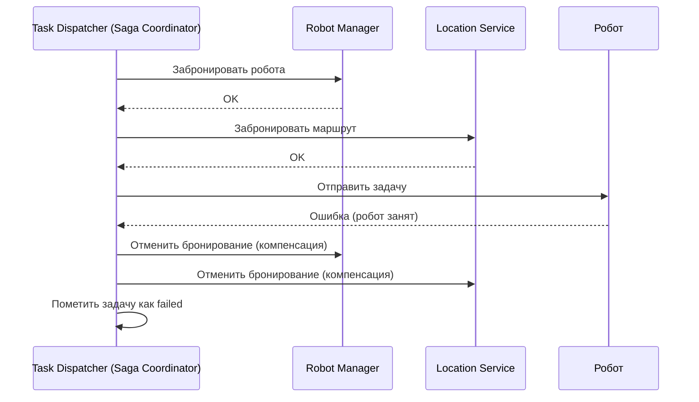
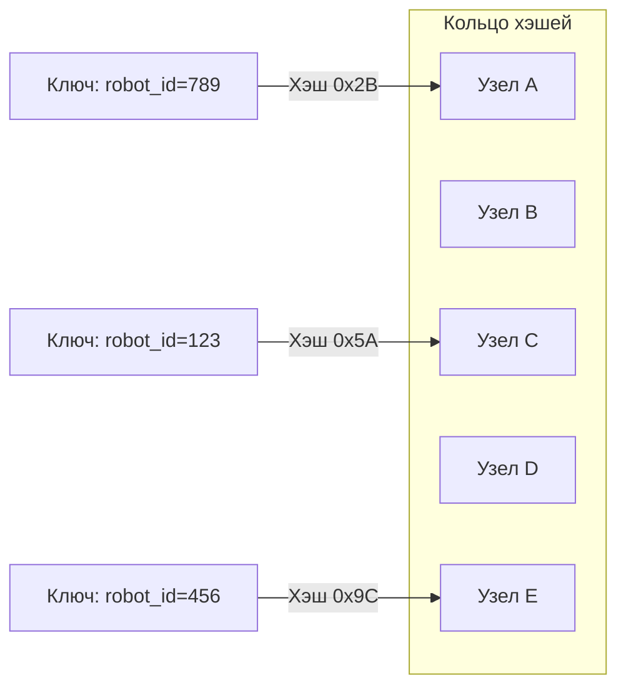

# Highload и отказоустойчивость

## 1. Highload-паттерны

Система управления роботами должна выдерживать высокие нагрузки (100 000+ RPS, 1000+ роботов). Для этого мы применяем следующие паттерны:

| Паттерн | Описание | Применение в RMS |
|---------|----------|------------------|
| **Rate Limiting** | Ограничение количества запросов от одного источника | Защита от DDoS, контроль нагрузки на модули (например, Task Dispatcher). |
| **Circuit Breaker** | Отключение "сломанного" компонента, чтобы избежать каскадных отказов | Если Kafka или PostgreSQL недоступны, переключаемся на fallback-режим. |
| **Retry с экспоненциальной задержкой** | Повторные попытки с увеличивающимся интервалом | При потере связи с роботом или ошибке в БД. |
| **Bulkhead** | Изоляция компонентов, чтобы сбой в одном не влиял на другие | Каждый модуль имеет свой пул соединений и очередь. |
| **Timeout** | Ограничение времени выполнения операции | Предотвращение зависаний (например, ожидание ответа от робота > 5 с). |

---

### 🔹 Circuit Breaker (Защитный выключатель)

Circuit Breaker — это паттерн, который предотвращает каскадные отказы. Он работает в три состояния:

| Состояние | Поведение | Переход |
|-----------|-----------|---------|
| **Closed** | Запросы проходят нормально. Счётчик ошибок увеличивается при сбоях. | При превышении порога ошибок (например, 5 сбоев за 10 с) → **Open**. |
| **Open** | Запросы блокируются немедленно (fallback-ответ). | По истечении таймаута (например, 30 с) → **Half-Open**. |
| **Half-Open** | Ограниченное количество запросов пропускается для проверки восстановления. | Если успешно → **Closed**; если сбой → **Open**. |

**Пример в RMS:**
- Если Kafka недоступна, Circuit Breaker переключает модули на fallback-режим (временное хранение событий в локальной очереди).
- Если PostgreSQL недоступен, запросы на чтение идут в Redis (кэш), а запись — в буфер.

---

### 🔹 Saga (распределённые транзакции)

Saga — это паттерн для управления распределёнными транзакциями без двухфазного коммита (2PC). Он использует компенсирующие действия для отката.

**Типы Saga:**

| Тип | Описание | Применение в RMS |
|-----|----------|------------------|
| **Оркестрация** | Центральный координатор (Task Dispatcher) управляет шагами и компенсациями. | Сложные процессы (например, "Забрать груз → Доставить → Зарядиться"). |
| **Хореография** | Участники общаются через события; каждый знает, как откатить свой шаг. | Локальные транзакции (например, обновление статуса робота). |

**Пример оркестрации (Saga + Event-Driven):**

---

### 🔹 Идемпотентность

Каждая операция должна быть идемпотентной — повторное выполнение не должно изменять состояние системы.

**Как это реализовано в RMS:**
- **UUID события:** каждое событие имеет уникальный ID, и подписчик проверяет его перед обработкой.
- **Версионирование:** при обновлении данных проверяется версия записи (оптимистичная блокировка).
- **Уникальные ограничения:** в БД (например, `task_id` + `robot_id` должны быть уникальны).

---

## 2. Отказоустойчивость

### 🔹 Типичные сбои и их обработка

| Сбой | Механизм восстановления |
|------|--------------------------|
| **Потеря связи с роботом** | Retry с экспоненциальной задержкой → перераспределение задачи → перевод робота в offline. |
| **Перегрузка модуля** | Rate Limiting → масштабирование (горизонтальное) → снижение нагрузки (degradation). |
| **Сбой в БД** | Репликация → failover (автоматическое переключение на реплику) → буферизация запросов. |
| **Сбой в шине (Kafka)** | Fallback-режим → локальное хранение событий → восстановление после перезапуска. |
| **Сбой в AI-модуле** | Периферийный AI продолжает работу; централизованный AI отключается до восстановления. |

---

### 🔹 Graceful Degradation (Плавная деградация)

При сбоях система должна сохранять минимальную функциональность:

| Уровень деградации | Доступные функции |
|--------------------|-------------------|
| **Полная** | Все модули работают. |
| **Частичная** | Нет AI, нет аналитики, но оркестрация и управление роботами работают. |
| **Минимальная** | Только базовое управление роботами (без оптимизации маршрутов). |

---

### 🔹 Изоляция и резервирование

- **Bulkhead:** каждый модуль имеет свой пул соединений и очередь.
- **Replication:** данные реплицируются (PostgreSQL master-slave, Redis cluster).
- **Health Checks:** мониторинг состояния модулей (liveness/readiness probes).
- **Graceful Shutdown:** корректное завершение при остановке (сохранение состояния, закрытие соединений).

---

## 3. Масштабирование данных (согласованный кэш и шардирование)

### 🔹 Согласованный кэш (Consistent Hashing)

Для распределения данных по шардам PostgreSQL мы используем согласованный кэш с виртуальными узлами.

**Алгоритм:**
1. Хэшируем ключ (например, `robot_id`) и помещаем на кольцо.
2. Поиск: бинарный поиск по отсортированному списку виртуальных узлов.
   - Если хэш <= максимальному узлу → выбираем ближайший больший.
   - Если хэш > максимальному → возвращаемся к началу кольца.
3. Виртуальные узлы решают проблему дисбаланса (каждый физический шард имеет N виртуальных копий).

**Преимущества:**
- **Динамическое добавление/удаление шардов** — перераспределяется только часть данных (1/N).
- **Минимизация нагрузки при миграции** — данные перемещаются только между соседними узлами на кольце.
- **Горизонтальное масштабирование** — можно добавлять новые шарды без остановки системы.

**Применение в RMS:**
- Шардирование PostgreSQL по `robot_id` (при росте данных > 1 ТБ).
- Кэширование состояний роботов в Redis (распределённый кэш).

---

## 4. Мониторинг и алертинг

### 🔹 Метрики

| Метрика | Источник | Порог оповещения |
|---------|----------|------------------|
| **Потери пакетов** | Клиент/сервер UDP | > 3% |
| **Задержка обработки событий** | Event Bus | > 50 мс (p95) |
| **CPU usage** | Модули | > 80% в течение 5 мин |
| **Memory usage** | Модули | > 90% |
| **Свободное место в БД** | PostgreSQL | < 20% |

### 🔹 Логирование и трейсинг

- **Структурированные логи:** JSON-формат для агрегации (ELK / Loki).
- **Распределённый трейсинг:** OpenTelemetry + Jaeger для отслеживания запросов между модулями.
- **Алертинг:** Prometheus + Alertmanager (Telegram / email).

---

## 5. Связь с эволюционной архитектурой

- **Фитнес-функции:**
  - **Триггерная:** нагрузочные тесты при каждом коммите (RPS, latency).
  - **Непрерывная:** мониторинг потерь пакетов и времени отклика.
  - **Временная:** проверка времени восстановления после сбоя (RTO < 1 мин, RPO < 5 мин).
- **Инкрементальные изменения:** добавление новых шардов и кэшей без остановки системы.

---

## 📎 Связанные документы

- [Модульный монолит](02-modular-monolith.md)
- [Event-Driven архитектура](04-event-driven.md)
- [Слой данных](07-data-layer.md)
- [Риски и компромиссы](10-risks-and-tradeoffs.md)

---

*Дата последнего обновления: 15 июля 2026*